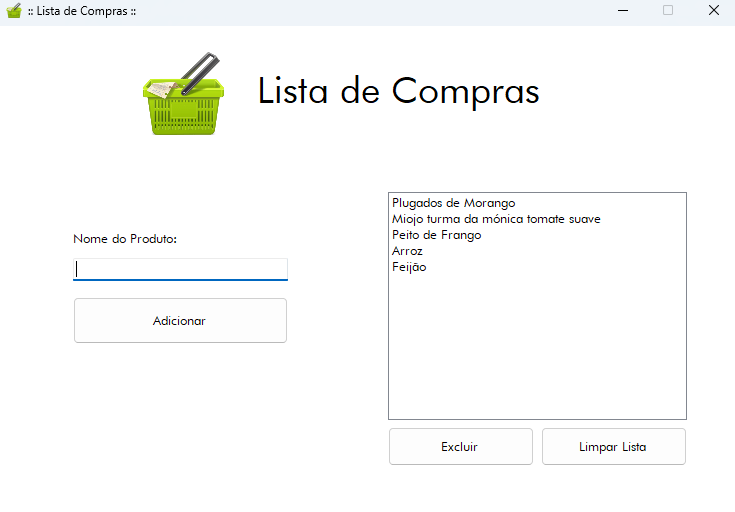

# 🛒 Lista de Compras - C#

Projeto simples de uma **lista de compras** desenvolvido em **C# com Windows Forms** no **Visual Studio 2022**. A aplicação permite adicionar, excluir e limpar produtos de uma lista utilizando `ListBox`, com validações e tratamento de erros.

## 📸 Captura de Tela



---

## ✨ Funcionalidades

- ✅ Adicionar itens à lista de compras
- ✅ Verificar se o nome do produto está vazio ou com menos de 2 caracteres
- ✅ Impedir duplicação de itens
- ✅ Remover item selecionado
- ✅ Limpar toda a lista com confirmação
- ✅ Suporte ao uso da tecla **Enter** para adicionar

---

## 🛠️ Tecnologias Utilizadas

- 💻 **Linguagem:** C#
- 🧰 **Framework:** Windows Forms (.NET Framework)
- 🧱 **Componentes:** ListBox, TextBox, Buttons, MessageBox
- 🛠 **IDE:** Visual Studio 2022

---

## 💡 Lógica Principal

A lógica da aplicação gira em torno de manipulação de listas com `ListBox`, validação de entrada do usuário e exibição de mensagens para feedback, por exemplo:

- Validação:
  ```csharp
  if (txbProduto.Text.Length == 0)
  {
      MessageBox.Show("O nome do produto não pode estar vazio!");
  }
